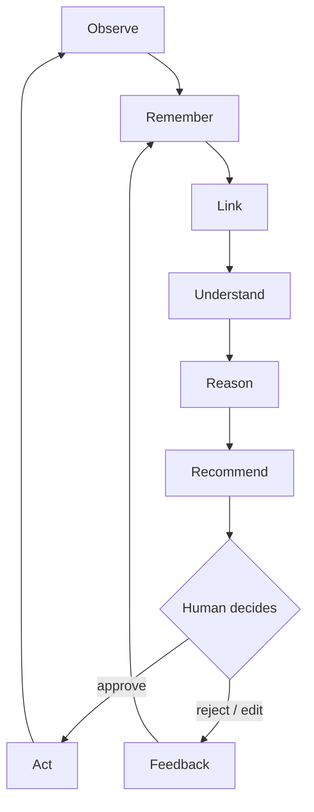
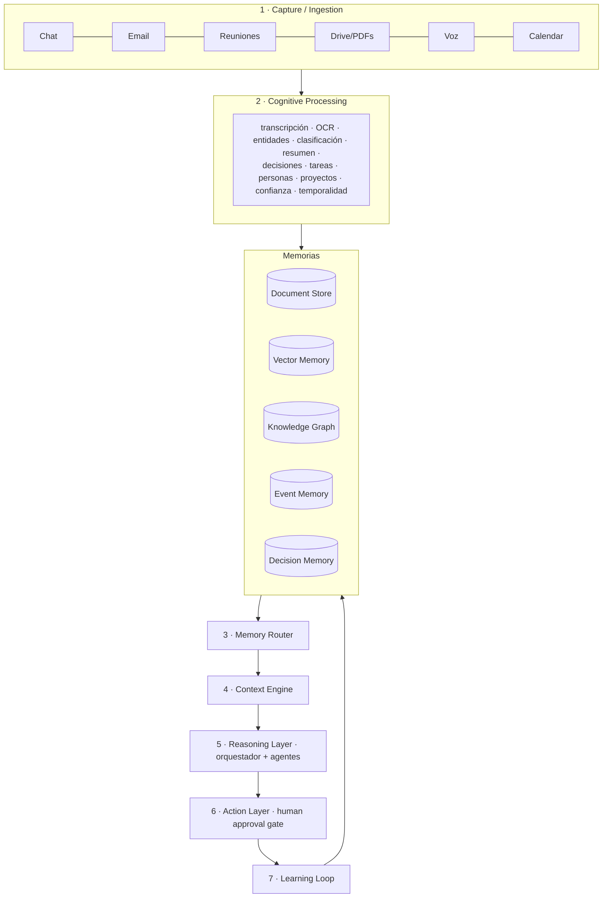

# 1 · Arquitectura funcional

El sistema no es "una base de conocimiento que conversa" sino una **memoria
digital persistente sobre la que opera una red de agentes**. El ciclo
completo:

## Las 7 capas

| Capa | Responsabilidad | Estado en V1 |
|---|---|---|
| 1 Captura | Todo lo que entra: notas, reuniones, papers, correos | Markdown vault (`brain/`), `sb ingest` |
| 2 Procesamiento cognitivo | Documento → knowledge objects, entidades, relaciones | `extract.py` (heurístico + Claude) |
| 3 Memorias | Almacenamiento híbrido por tipo de memoria | SQLite (`store.py`), esquema PG en `db/` |
| 4 Router | Clasificar la pregunta antes de recuperar | `router.py` |
| 5 Context Engine | Context pack mínimo, relevante y trazable | `context.py` |
| 6 Razonamiento / Acción | LLM + agentes + approval gate | `llm.py` (respuesta con citas); agentes en V4 |
| 7 Learning loop | Feedback → nueva memoria | tabla `feedback` (registro en V2) |

## Principio rector

**No todo entra a una base vectorial.** Documentos completos para contexto y
preguntas agregadas; embeddings para similitud semántica; grafo para
relaciones; SQL para lo exacto y lo temporal. El router decide cuál usar.

## Ejemplo end-to-end

Pregunta: *"¿Qué debería discutir mañana con Ricardo?"*

1. **Router** → intent `strategic` → plan: grafo, decisiones, compromisos,
   memoria episódica, documentos.
2. **Context Engine** reconstruye: relación Inti–Ricardo, proyectos activos
   compartidos, reuniones previas, compromisos abiertos, decisiones
   recientes, preguntas no resueltas, calendario (V2).
3. **Reasoning** recibe ese context pack y recién entonces responde,
   citando fuentes y distinguiendo confirmado de tentativo.
