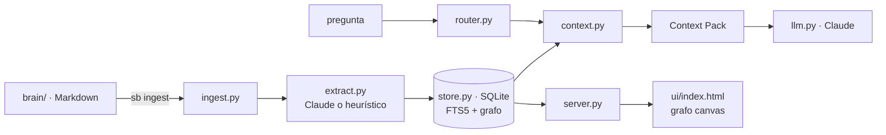

# 2 · Arquitectura técnica

## Stack por versión

| Componente | V1 (este repo, hoy) | V2–V3 | V4 |
|---|---|---|---|
| Interfaz | CLI `sb` + UI web (grafo) | + voz, conectores | + agentes proactivos |
| Conocimiento primario | Markdown (`brain/`) | + Google Drive, Gmail, Calendar | igual |
| Memoria estructurada | SQLite | PostgreSQL | PostgreSQL |
| Memoria semántica | FTS5 (BM25) | + pgvector (híbrido BM25+vector) | igual |
| Knowledge graph | tablas entities/relationships | igual, consultas recursivas | Neo4j si el modelo lo exige |
| LLM | Claude (`claude-opus-5`) | igual | orquestador multi-agente |
| Orquestación | — | Python | LangGraph / Agent SDK |
| Observabilidad | logs | Langfuse | Langfuse |
| Permisos | local, single-user | OAuth + RBAC | + approval gate por acción |

**Decisión deliberada:** no se parte con Neo4j ni con orquestadores. Se sube
de nivel solo cuando el problema de recuperación lo requiere. Mayor
complejidad no significa mejor segundo cerebro.

## Componentes V1

- **`ingest.py`** — parsea Markdown + frontmatter YAML; deduplica por hash
  de contenido (re-ingestar es idempotente).
- **`extract.py`** — `ClaudeExtractor` (si hay credenciales) o
  `HeuristicExtractor` (convenciones `DECISIÓN:`, `- [ ]`, `PREGUNTA:`).
  El sistema siempre funciona sin red.
- **`store.py`** — SQLite con FTS5; el mismo modelo que `db/schema.sql`
  (PostgreSQL + pgvector) para migrar sin reescribir dominio.
- **`router.py` / `context.py`** — clasificación de intención y construcción
  del context pack.
- **`llm.py`** — capa de razonamiento: system prompt con reglas de
  trazabilidad (citar fuente, respetar `confidence` y temporalidad).
- **`server.py` + `ui/`** — API JSON de solo lectura + frontend del grafo
  (canvas force-directed, sin dependencias externas).

## Integración con Claude

- Modelo por defecto `claude-opus-5` (configurable con `SB_MODEL`).
- Credenciales por entorno (`ANTHROPIC_API_KEY` o perfil `ant auth login`);
  nunca en el repo.
- El system prompt de extracción es estable y se cachea con
  `cache_control: ephemeral` (el documento variable va después).

## Datos sensibles

El vault contiene información clínica y organizacional. Reglas desde V1:

1. El vault y la base local (`.brain/`) están en `.gitignore` — el repo
   versiona plantillas y código, no memoria personal (la nota de ejemplo en
   `inbox/` es sintética).
2. En V2, la información sensible va a un store cifrado separado y los
   conectores usan OAuth con mínimo privilegio.
3. Toda acción externa (correo, calendario) pasa por el approval gate.
