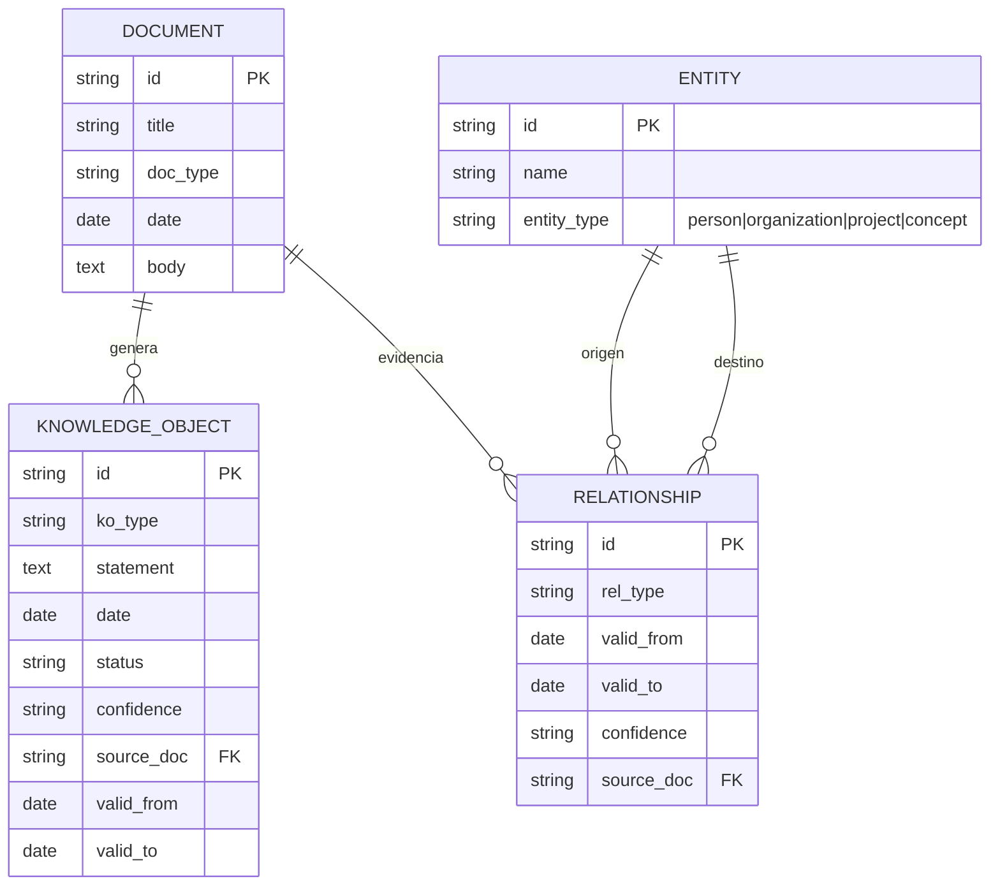
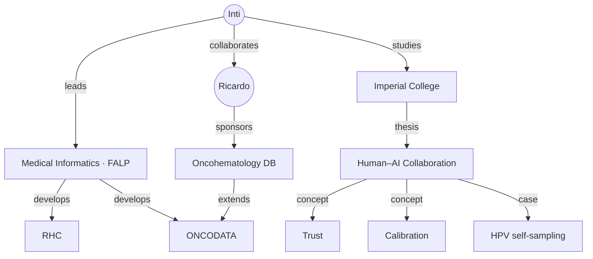

# 3 · Modelo de datos y knowledge graph

## La unidad fundamental: el Knowledge Object

La unidad no es la nota, es el **Knowledge Object (KO)**: una pieza atómica
de conocimiento tipada, con personas, proyecto, temporalidad, confianza y
trazabilidad a su fuente.

```yaml
id: ko-9f2c41ab
ko_type: decision           # decision | task | fact | idea | question | hypothesis | event
title: Modelo de captura de datos oncohematológicos
statement: Se acuerda avanzar con una base de datos validada para cánceres oncohematológicos.
people: [Inti, Ricardo, Raimundo]
project: Oncohematology Data Platform
date: 2026-08-12
status: active              # active | done | superseded | archived
confidence: confirmed       # confirmed | probable | tentative
source_doc: doc-1a2b3c      # → brain/inbox/2026-08-12-reunion-oncohematologia.md
valid_from: 2026-08-12
valid_to: null              # null = sigue vigente
tags: [oncología, datos-clínicos]
```

Una reunión de una hora genera típicamente: 1 documento fuente → varios KOs
(decisiones, tareas, preguntas) → entidades → relaciones. El conocimiento
se acumula estructuradamente en vez de convertirse en un cementerio de PDFs.

## Entidades y relaciones (el grafo)



### Temporalidad: la dimensión que casi nadie modela

Cada relación lleva `valid_from` / `valid_to`, `confidence` y `source_doc`:

```text
Ricardo ──approved──► Oncohematology DB proposal
             ├── valid_from: 2026-08-12
             ├── source: meeting_20260812
             ├── confidence: confirmed
             └── status: active
```

Esto permite distinguir **"esto era cierto en marzo"** de **"esto sigue
siendo cierto hoy"**, y responder preguntas históricas sin contaminar el
presente.

## Ejemplo de grafo



## Esquemas

- **V1 (operativo):** SQLite — `src/segundo_cerebro/store.py`.
- **V2+ (objetivo):** PostgreSQL + pgvector — `db/schema.sql`. Mismo modelo;
  agrega `chunks` con embeddings HNSW para la memoria semántica.
