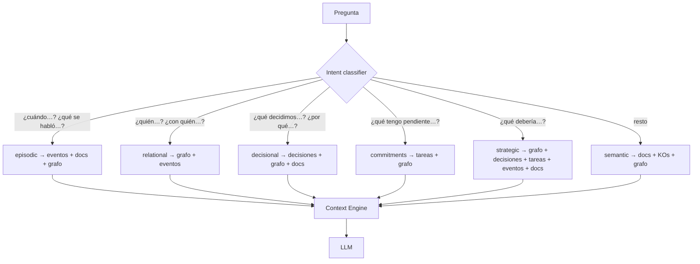

# 4 · Estructura de memoria y router

## Memoria ≠ archivos: seis tipos de memoria

| Memoria | Ejemplo | Tecnología V1 | Tecnología objetivo |
|---|---|---|---|
| **Identidad** | rol, objetivos, forma de trabajo | `brain/self/*.md` | structured profile |
| **Semántica** | qué sé sobre Human–AI collaboration | FTS5 sobre docs y KOs | pgvector + documentos |
| **Episódica** | reunión con Ricardo el 12 de agosto | KOs tipo `event` | PostgreSQL / timeline |
| **Relacional** | Ricardo patrocina la base oncohematológica | entities + relationships | knowledge graph |
| **Decisional** | decidimos integrar con el RHC, porque… | KOs tipo `decision` | decision ledger |
| **Procedimental** | cómo preparo una reunión de gerencia | `brain/templates/` | skills / workflows |

## El Memory Router

Antes de buscar, el sistema clasifica la pregunta (`router.py`). Cada intent
tiene un plan de memorias en orden:

Reglas de diseño:

- **Exacto/agregado → SQL o documento completo**, nunca vector search: la
  búsqueda vectorial recupera fragmentos y falla en preguntas agregadas
  ("¿cuánto hemos gastado?").
- **Relacional → grafo**: traversal, no similitud.
- **Estratégico → multi-fuente**: el context pack combina grafo, decisiones,
  compromisos, episodios y documentos.

## El Context Engine

`context.py` construye un **context pack** que responde, antes de razonar:

- ¿Quién soy y qué estoy haciendo? (identidad, V2)
- ¿Qué proyecto y qué personas están involucradas? (grafo)
- ¿Qué pasó antes? (episódica)
- ¿Qué decisiones ya existen? (decisional)
- ¿Qué sigue abierto? (questions + tasks activas)
- ¿Qué evidencia lo respalda? (cada pieza cita `source_doc`)

El pack es inspeccionable (`sb ask --context-only`): siempre puedes ver
exactamente qué contexto recibió el LLM. Eso es **context engineering**,
no simplemente búsqueda.
