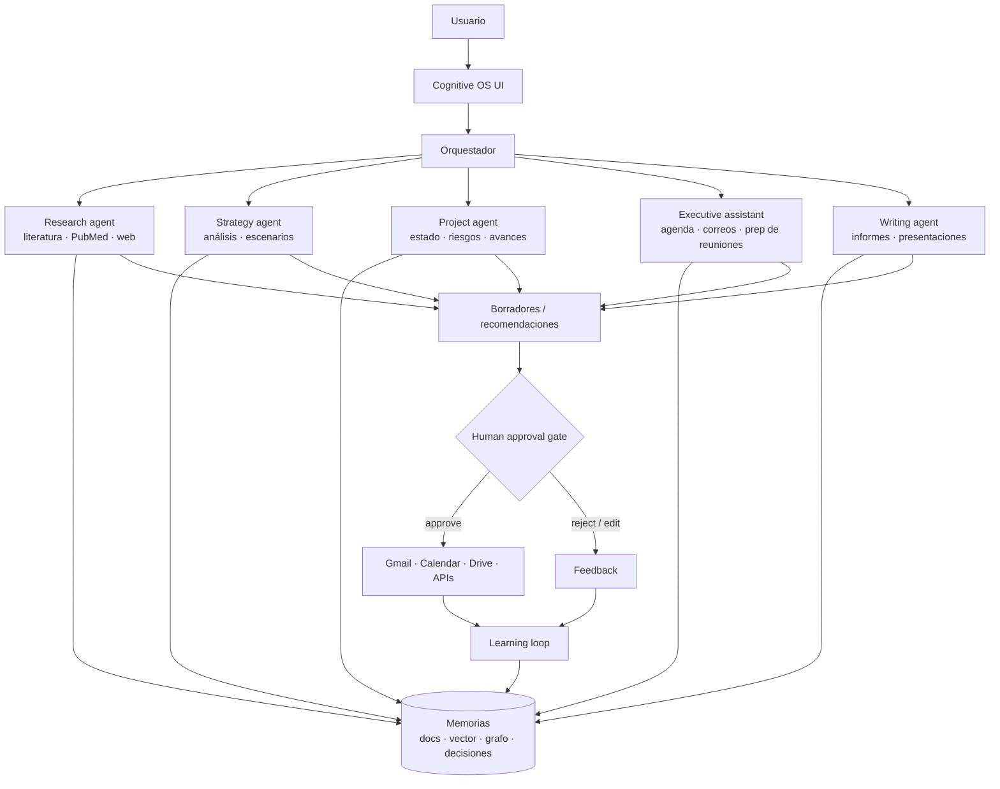

# 5 · Flujo de agentes (V4)

La capa agéntica se construye **al final**, cuando la memoria ya es sólida:
un agente sin buena memoria solo automatiza errores con más velocidad.

## Arquitectura

## Reglas no negociables

1. **Toda acción externa pasa por el approval gate.** Los agentes redactan
   y recomiendan; el humano decide. Sin excepciones en correo, calendario o
   documentos compartidos.
2. **Todo output cita su memoria.** Un agente que no puede señalar de qué
   KOs y documentos salió su recomendación no la entrega.
3. **El feedback es memoria.** Aceptado / rechazado / editado se registra
   (tabla `feedback`) y alimenta las preferencias del usuario: el sistema
   aprende qué recomendaciones sirven, qué hipótesis fallaron y qué
   preferencias aparecen.
4. **Autonomía gradual.** Primero solo lectura (research, resúmenes), luego
   borradores, luego acciones aprobadas una a una, y solo al final acciones
   pre-aprobadas por categoría (p. ej. "agendar con mi equipo directo").

## Ejemplo: "prepárame la reunión con Ricardo"

1. Orquestador → Project agent: estado de proyectos compartidos (grafo +
   KOs).
2. → Executive assistant: última reunión, compromisos abiertos de cada
   parte, decisiones recientes, preguntas no resueltas.
3. → Writing agent: one-pager con agenda propuesta, cada punto con su
   fuente.
4. Gate: el usuario edita/aprueba → se guarda como documento y, aprobado,
   se agenda/envía.
5. Learning loop: qué puntos se usaron realmente → mejora la próxima
   preparación.
