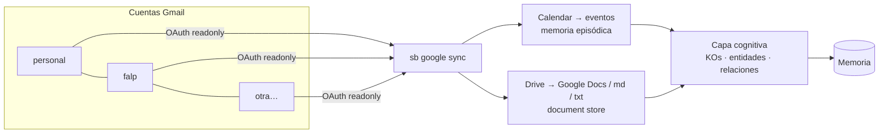

# 7 · Conectores Google (Drive + Calendar, multi-cuenta)

Los conectores convierten tu Google Calendar y Google Drive en productores
del mismo `Document` que el vault Markdown: la extracción, el grafo y el
router no distinguen el origen. Soportan **todas tus cuentas Gmail**, cada
una con su propio token OAuth identificado por un alias.



## Configuración inicial (una sola vez, ~10 minutos)

Necesitas una credencial OAuth propia (el sistema corre en tu máquina; no
hay servidor de terceros):

1. Entra a [Google Cloud Console](https://console.cloud.google.com/) con
   cualquiera de tus cuentas y crea un proyecto (p. ej. `segundo-cerebro`).
2. **APIs & Services → Library**: habilita **Google Drive API** y
   **Google Calendar API**.
3. **APIs & Services → OAuth consent screen**: tipo **External**, rellena
   nombre y correo. En **Test users** agrega TODOS tus correos Gmail
   (personal, trabajo, etc.) — en modo testing solo esos correos podrán
   autorizar.
4. **APIs & Services → Credentials → Create credentials → OAuth client ID**:
   tipo **Desktop app**. Descarga el JSON.
5. Guárdalo como `.brain/google/client_secret.json` (la carpeta `.brain/`
   está en `.gitignore`; nunca se versiona).

## Conectar cada cuenta

```bash
pip install -e ".[google]"

sb google connect personal    # abre el navegador → inicia sesión con tu Gmail personal
sb google connect falp        # otra vez, con el correo institucional
sb google accounts            # lista: falp, personal
```

Cada `connect` guarda un refresh token en `.brain/google/token-<alias>.json`;
no vuelve a pedir login.

## Sincronizar

```bash
sb google sync                          # todas las cuentas: Calendar ±30 días + Drive incremental
sb google sync --account falp           # solo una cuenta
sb google sync --days-back 90           # más historia de calendario
sb google sync --query "name contains 'FALP'"   # acotar Drive a un tema/carpeta
sb google sync --no-drive               # solo calendario
```

Qué hace cada servicio:

| Servicio | Qué trae | A qué memoria va |
|---|---|---|
| Calendar | eventos ±N días de `primary`, con asistentes y descripción | episódica (KO `event`); asistentes → grafo |
| Drive | Google Docs (export texto), `.md`, `.txt` nuevos/modificados | document store + semántica |

La sincronización es **incremental e idempotente**: Drive usa un cursor
`modifiedTime` por cuenta (`.brain/google/state-<alias>.json`) y todo
documento se deduplica por hash de contenido — puedes correr `sync` en cron
sin duplicar memoria.

## Automatizar

```bash
# crontab -e — cada mañana a las 7:00
0 7 * * * cd /ruta/a/segundo-cerebro && sb google sync >> .brain/sync.log 2>&1
```

## Privacidad y límites

- **Scopes de solo lectura** (`drive.readonly`, `calendar.readonly`): el
  sistema observa, jamás modifica ni envía nada.
- Tokens, cursores y la base viven en `.brain/` (local, fuera de git).
- V2 actual no ingesta PDFs, planillas ni presentaciones de Drive (pedirán
  parsing dedicado), ni el contenido de Gmail — ese conector es una
  decisión aparte por sensibilidad, y conviene activarlo con filtros
  (etiquetas/remitentes) cuando llegue.
- Con credenciales de Claude configuradas, cada documento sincronizado pasa
  por extracción semántica (decisiones, tareas, personas, relaciones); sin
  ellas, extracción heurística.
