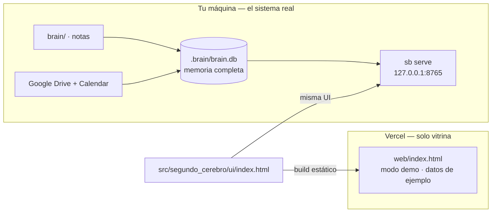

# 8 · Despliegue en Vercel (vitrina pública)

**Regla de arquitectura: el cerebro corre solo en tu máquina.** Vercel
publica únicamente la *vitrina* — la interfaz en modo demo, con datos de
ejemplo. Tu memoria, tus notas, tu calendario y tus tokens de Google nunca
salen de tu equipo.



Qué se publica y qué no:

| | Local (`sb serve`) | Vercel |
|---|---|---|
| Interfaz del grafo | ✅ | ✅ (idéntica) |
| Tu memoria real | ✅ | ❌ nunca |
| API `/api/*` | ✅ sobre SQLite | ❌ no existe |
| Ingesta, Google, Claude | ✅ | ❌ |

La UI detecta que no hay API y entra sola en modo demo, con el distintivo
«modo demo · datos de ejemplo».

## Desplegar

```bash
npm i -g vercel      # o usa npx delante de cada comando
vercel login
vercel               # preview: te da una URL para revisar
vercel --prod        # producción
```

Vercel lee [`vercel.json`](../vercel.json): ejecuta
`node scripts/build-web.mjs`, que genera `web/index.html` a partir de la
misma UI que usa el servidor local, y publica esa carpeta como sitio
estático. No hay funciones serverless ni base de datos.

Alternativa sin CLI: en [vercel.com/new](https://vercel.com/new) importa el
repositorio de GitHub; la configuración se toma de `vercel.json` y cada push
redespliega.

## Garantías de privacidad

1. `.gitignore` bloquea `.brain/`, `data/snapshot.json`, `*.snapshot.json`
   y el vault personal: nada de eso llega al repositorio ni, por tanto, a
   Vercel.
2. El build no lee la base ni el vault — solo copia la plantilla de la UI.
3. `web/` es generado: se reconstruye en cada deploy y no se versiona.

Si algún día quisieras publicar una instancia con memoria real, hazlo en un
proyecto privado y con **Vercel Deployment Protection** (contraseña o SSO)
activada — pero la recomendación es mantenerla local.

## Snapshot local (opcional, no es para publicar)

`sb export` congela la memoria en un JSON: sirve como respaldo o para abrir
la UI contra una copia de solo lectura.

```bash
sb export                              # → data/snapshot.json (ignorado por git)
sb export --no-bodies                  # sin el texto completo de los documentos
sb serve --snapshot data/snapshot.json # UI sobre la copia congelada
```

## Publicar la UI sin exponer nada más

Si solo quieres enseñar cómo se ve el sistema, el sitio de Vercel basta.
Para compartir un análisis puntual, exporta lo que quieras mostrar a mano;
no publiques el snapshot completo.
